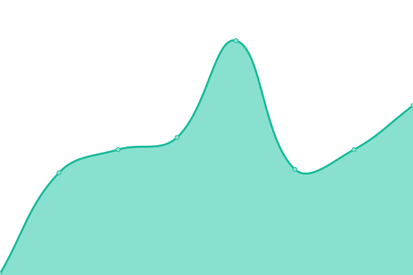
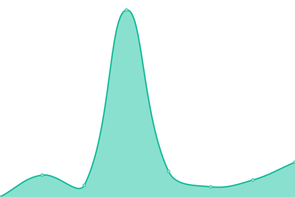

# [📈 Live Status](https://staging.pabiostatus.com): <!--live status--> **🟩 All systems operational**

This repository contains the open-source uptime monitor and status page for [Pabio Status](https://pabiostatus.com), powered by [Upptime](https://github.com/upptime/upptime).

With [Upptime](https://upptime.js.org), you can get your own unlimited and free uptime monitor and status page, powered entirely by a GitHub repository. We use [Issues](https://github.com/pabio-status/staging/issues) as incident reports, [Actions](https://github.com/pabio-status/staging/actions) as uptime monitors, and [Pages](https://staging.pabiostatus.com) for the status page.

<!--start: status pages-->
<!-- This summary is generated by Upptime (https://github.com/upptime/upptime) -->
<!-- Do not edit this manually, your changes will be overwritten -->
<!-- prettier-ignore -->
| URL | Status | History | Response Time | Uptime |
| --- | ------ | ------- | ------------- | ------ |
|  [Pabio.dev](https://pabio.dev) | 🟩 Up | [pabio-dev.yml](https://github.com/pabio-status/staging/commits/HEAD/history/pabio-dev.yml) | 

 352ms
     
 | 

<a href="https://staging.pabiostatus.com/history/pabio-dev">100.00%</a>
    

|  [Pabio Dev API v20211107](https://v20211107.pabioapi.dev/health) | 🟩 Up | [pabio-dev-api-v20211107.yml](https://github.com/pabio-status/staging/commits/HEAD/history/pabio-dev-api-v20211107.yml) | 

 403ms
     
 | 

<a href="https://staging.pabiostatus.com/history/pabio-dev-api-v20211107">100.00%</a>
    

|  [Pabio API v20210503](https://v20210503.pabioapi.com/health) | 🟩 Up | [pabio-api-v20210503.yml](https://github.com/pabio-status/staging/commits/HEAD/history/pabio-api-v20210503.yml) | 

 376ms
     
 | 

<a href="https://staging.pabiostatus.com/history/pabio-api-v20210503">100.00%</a>
    

|  [Pabio Dev API v20210503](https://v20210503.pabioapi.dev/health) | 🟩 Up | [pabio-dev-api-v20210503.yml](https://github.com/pabio-status/staging/commits/HEAD/history/pabio-dev-api-v20210503.yml) | 

 408ms
     
 | 

<a href="https://staging.pabiostatus.com/history/pabio-dev-api-v20210503">100.00%</a>
    

|  [PabioLounge.com](https://pabiolounge.com) | 🟩 Up | [pabio-lounge-com.yml](https://github.com/pabio-status/staging/commits/HEAD/history/pabio-lounge-com.yml) | 

 203ms
     
 | 

<a href="https://staging.pabiostatus.com/history/pabio-lounge-com">100.00%</a>
    

|  [PabioLounge.dev](https://pabiolounge.dev) | 🟩 Up | [pabio-lounge-dev.yml](https://github.com/pabio-status/staging/commits/HEAD/history/pabio-lounge-dev.yml) | 

 266ms
     
 | 

<a href="https://staging.pabiostatus.com/history/pabio-lounge-dev">100.00%</a>
    

<!--end: status pages-->

[**Visit our status website →**](https://staging.pabiostatus.com)

## 📄 License

- Powered by: [Upptime](https://github.com/upptime/upptime)
- Code: [MIT](./LICENSE) © [Pabio Status](https://pabiostatus.com)
- Data in the `./history` directory: [Open Database License](https://opendatacommons.org/licenses/odbl/1-0/)
